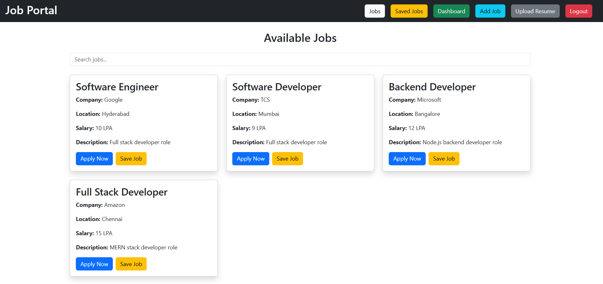
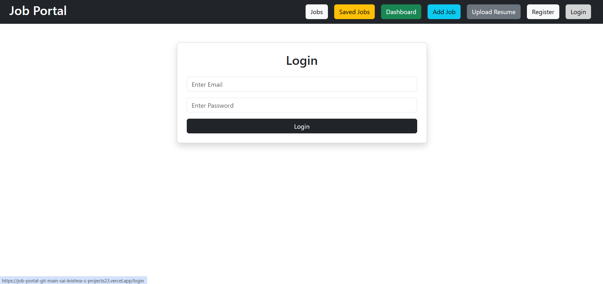
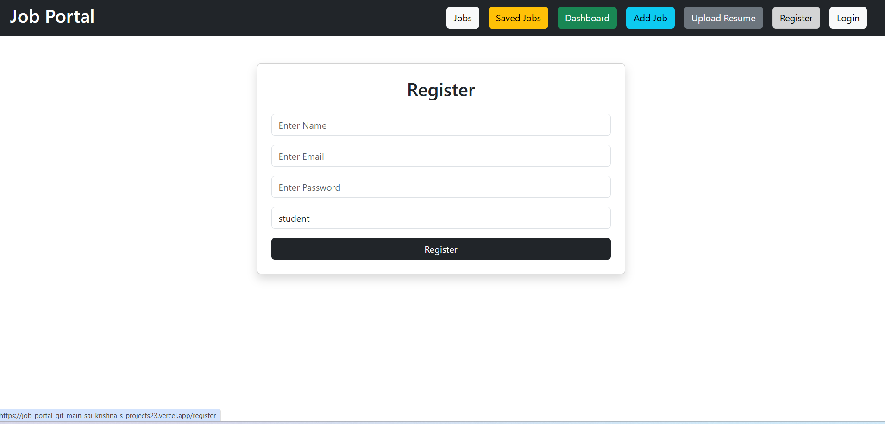
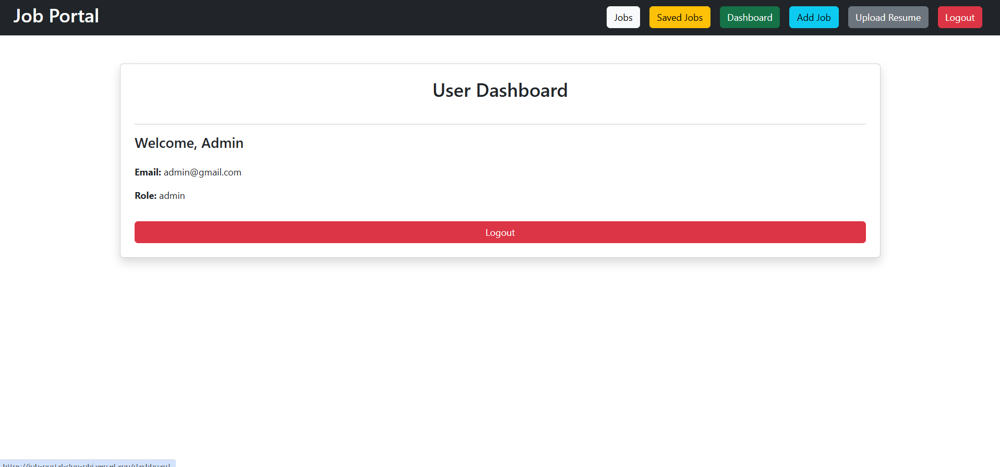
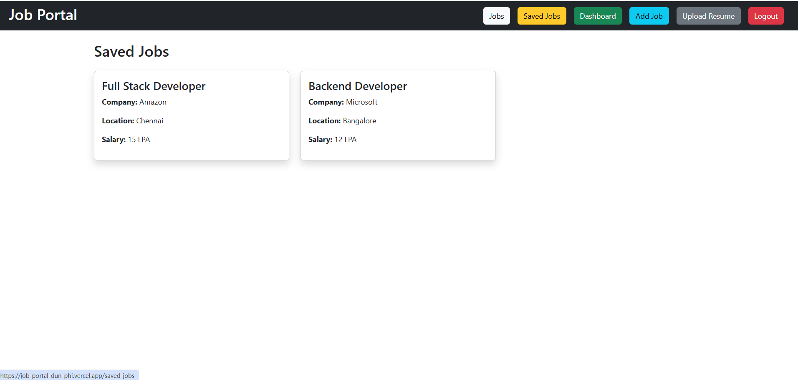
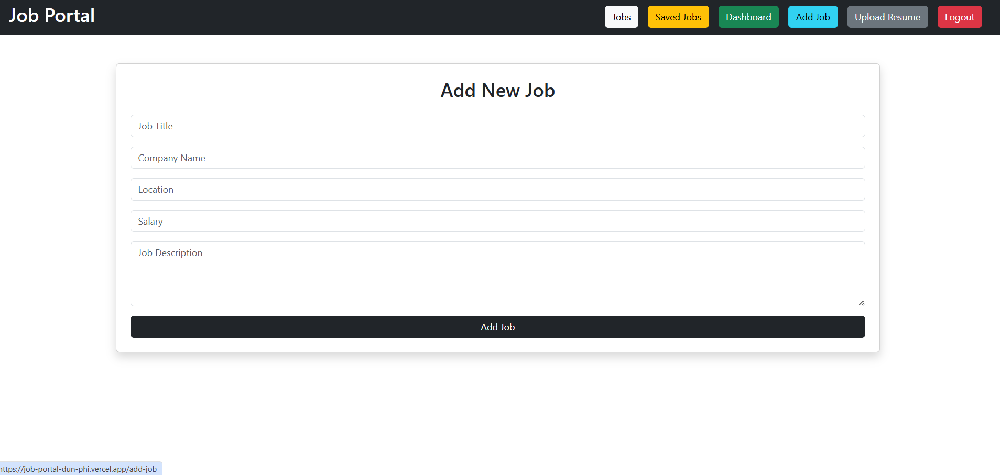

# 🚀 MERN Stack Job Portal

A full-stack Job Portal web application developed using the MERN Stack (MongoDB, Express.js, React.js, Node.js).

---

# 🚀 Features

* User Registration & Login
* JWT Authentication
* Protected Routes
* Admin-only Job Posting
* Save Jobs Feature
* Resume Upload
* Dashboard
* MongoDB Atlas Integration
* Responsive UI
* Cloud Deployment

---

# 🛠️ Tech Stack

## Frontend

* React.js
* Bootstrap
* Axios
* React Router DOM

## Backend

* Node.js
* Express.js
* JWT Authentication
* Multer

## Database

* MongoDB Atlas

## Deployment

* Frontend: Vercel
* Backend: Render

---

# 📂 Project Structure

```bash
job-portal/
├── backend/
├── frontend/
├── screenshots/
└── README.md
```

---

# ⚙️ Installation

## Clone Repository

```bash
git clone https://github.com/SaikrishnaAligeti-12/Job-Portal.git
```

---

## Install Frontend Dependencies

```bash
cd frontend
npm install
```

---

## Install Backend Dependencies

```bash
cd backend
npm install
```

---

## Run Frontend

```bash
npm start
```

---

## Run Backend

```bash
node server.js
```

---

# 🌐 Live Demo

## Frontend

https://job-portal-dun-phi.vercel.app

## Backend

https://job-portal-backend-upve.onrender.com

---

# 📸 Screenshots

## 🏠 Home Page



---

## 🔐 Login Page



---

## 📝 Register Page



---

## 📊 Dashboard



---

## ❤️ Saved Jobs Page



---

## ➕ Add New Jobs Page



---

# 📚 Learning Outcomes

* MERN Stack Development
* REST API Development
* JWT Authentication
* MongoDB Atlas Integration
* Cloud Deployment
* Full-Stack Project Architecture

---

# 👨‍💻 Author

## Sai Krishna Aligeti

GitHub:
https://github.com/SaikrishnaAligeti-12
